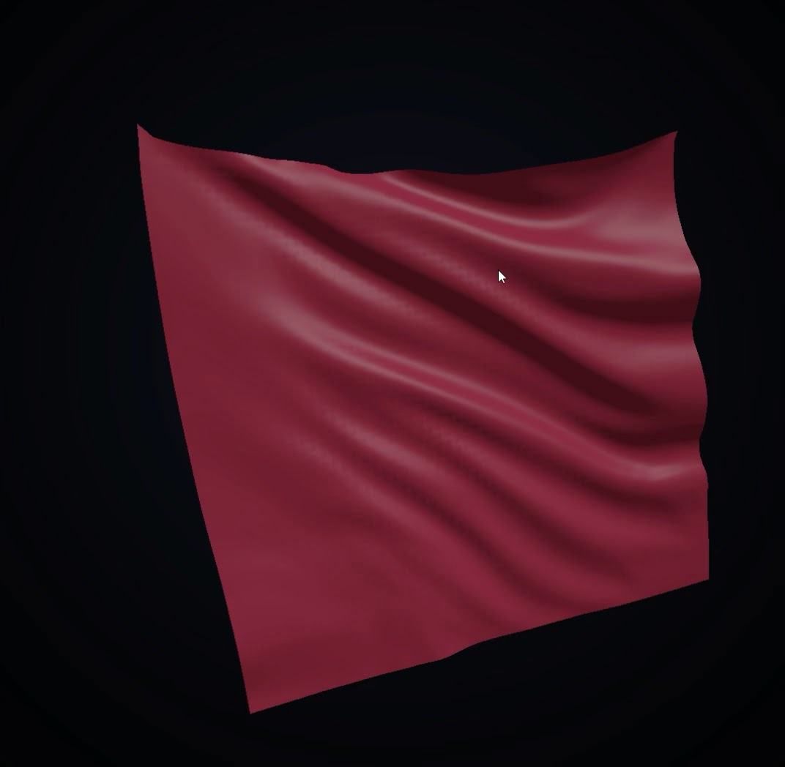

# Cloth

A real-time cloth simulation demo written in C#/.NET using raw Win32, WGL, and OpenGL 3.3 core profile.

The program simulates a hanging sheet of cloth as a grid of point masses connected by distance constraints. The cloth is integrated with Verlet integration, relaxed with several Position-Based Dynamics style constraint iterations per frame, affected by gravity and procedural wind, and rebuilt into a lit two-sided OpenGL mesh every frame.

This is intentionally a small, low-dependency graphics/physics demo: there are no NuGet packages, no game engine, no OpenGL wrapper, and no external assets. Window creation, input handling, WGL context creation, OpenGL function loading, shaders, mesh generation, and simulation logic are implemented directly in `Program.cs`.

## Screenshot
 

## Features

- Real-time cloth simulation on a `64 x 64` particle grid.
- Verlet integration with damping.
- Structural, shear, and bend distance constraints.
- Multiple solver iterations per frame for a more stable cloth shape.
- Two pinned top corners, producing a hanging fabric effect.
- Procedural gravity, wind, and small turbulence forces.
- Mouse picking and dragging of cloth particles.
- Orbit camera and zoom controls.
- Dynamic normal generation for lighting.
- Two-sided cloth shading with different front/back colors.
- Particle self-collision via a uniform spatial hash, so folds don't pass through the sheet.
- UV coordinates and a procedurally generated woven fabric texture (plain weave) with mipmapping.
- Minimal OpenGL 3.3 rendering pipeline with runtime shader compilation.
- Raw Win32/WGL window and OpenGL context setup through P/Invoke.

## Controls

| Input | Action |
| --- | --- |
| Left mouse button + drag | Grab and drag the nearest cloth particle |
| Right mouse button + drag | Rotate/orbit the camera |
| Mouse wheel | Zoom in/out |
| Close window | Exit the program |

## Requirements

- Windows.
- .NET SDK.
- A GPU and driver supporting OpenGL 3.3 or newer.
- Visual Studio, Rider, or the `dotnet` CLI.

The project is Windows-specific because it uses direct Win32, GDI, and WGL calls through P/Invoke.

## Build and run

From the project directory:

```bash
dotnet run --project Cloth.csproj -c Release
```

Or open the project/solution in a recent IDE that supports the project format and run the `Cloth` project in Release mode.

## Project structure

```text
Cloth.csproj   .NET project file
Cloth.slnx     Solution file
Program.cs     Simulation, Win32 windowing, OpenGL loading, rendering, shaders, and input
```

## How it works

The cloth is represented as a square grid of particles. Each particle stores its current and previous position. Velocity is implicit: in Verlet integration it is derived from the difference between the current and previous positions.

Each simulation step applies gravity, wind, and turbulence to all unpinned particles. The predicted positions are then corrected by repeatedly solving distance constraints. The constraints keep neighboring particles at approximately fixed distances and are grouped into three practical categories:

- structural constraints, which connect horizontal and vertical neighbors;
- shear constraints, which connect diagonal neighbors;
- bend constraints, which connect particles two cells apart and reduce excessive folding.

After the solver pass, pinned particles are forced back to their fixed positions. The current particle grid is then converted into a triangle mesh. Per-vertex normals are recalculated from neighboring particle positions, uploaded to a dynamic OpenGL vertex buffer, and rendered with a small GLSL lighting shader.

## Important parameters

The main simulation parameters are defined near the top of `Program.cs`:

```csharp
const int N = 64; // cloth grid resolution
const float W = 2.0f; // cloth width/height in world units
const float Gravity = 9.8f;
const float Damp = 0.99f; // Verlet damping
const int SubSteps = 2;
const int Iters = 10; // constraint relaxation passes
const float Dt = 1f / 120f;
```

Useful tuning directions:

- Increase `N` for a denser cloth mesh, at higher CPU/GPU cost.
- Increase `Iters` for stiffer and more stable cloth.
- Decrease `Damp` for heavier damping and less oscillation.
- Adjust the wind and turbulence expressions in `Step(float t)` to change the movement style.

## Implementation notes

This project deliberately avoids helper frameworks. The code manually:

- registers a Win32 window class;
- creates a native window;
- selects a pixel format;
- creates a WGL/OpenGL context;
- loads OpenGL function pointers with `wglGetProcAddress`;
- compiles GLSL shaders at runtime;
- creates VAO/VBO/EBO objects;
- processes Win32 mouse and window messages.

That makes the program useful as a compact reference for how a C# application can talk directly to Win32 and OpenGL without using OpenTK, Silk.NET, SDL, GLFW, or a game engine.

## Current limitations

- The program is Windows-only.
- The simulation is CPU-based and single-threaded.
- The entire project is currently contained in one source file.
- There is no texture mapping, tearing, self-collision, or cloth-object collision in the active simulation path.
- The source contains sphere-related constants and a sphere mesh helper, but sphere rendering/collision is not wired into the current frame loop.
- Error handling is intentionally minimal and demo-oriented.

## Possible improvements

- Add active sphere collision and render the sphere as an obstacle.
- Add cloth self-collision.
- Add tearing by removing overstretched constraints.
- Add texture coordinates and fabric textures.
- Move Win32, OpenGL, math, simulation, and rendering code into separate files.
- Add UI controls for simulation parameters.
- Add FPS/frame-time display.
- Add screenshot or video capture support.
- Add compute-shader or GPU-based simulation experiments.

## License

MIT
